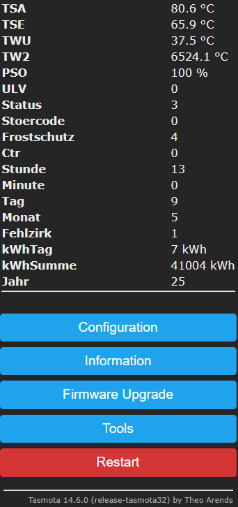

# tasmosysta

**Tasmosysta** is a project to connect *SystaSolar* controller to *Tasmota* using the SystaBus protocol.  
It reads system values via a serial interface and publishes them as MQTT messages, enabling integration into your home automation environment (e.g. Node-RED, Home Assistant, etc.).

## Features

- Reads and decodes sensor and system data from SystaSolar
- Sends MQTT messages with current values every minute
- Detects and publishes:
  - Temperatures (TSA, TSE, TWU, TW2)
  - Status and error codes (with text translations)
  - Time and date (hour, minute, day, month)
  - Energy data (kWh of the day and total)
  - Alive signal every 30 seconds to monitor connectivity
- Live preview via Tasmota Web UI

## Requirements

- **Systa-Bus to serial converter**, e.g. via:  
  https://ringwelt.de/homeautomation/heizungsanlage/einfuehrung.html
- **Tasmota32 firmware** (for ESP32 devices) with **Berry scripting support**
  _(Tested with: Tasmota32 14.6.0)_
- **Paradigma SystaSolar** controller  
  _(Tested with: SystaSolar Aqua Rev.1, Firmware V2.22)_
- MQTT broker (e.g. Mosquitto) if you don't have one already

## Installation

1. Flash your ESP32 device with [Tasmota32]
2. Upload the Berry script `systasolar.be` via **"Manage File System"** menu
3. Enable `systasolar.be` in your `autoexec.be`
4. Connect the SystaBus converter to GPIO (Default 8)
5. Script will start automatically after restart and begin publishing MQTT messages

## MQTT Topics

All values are published with the prefix:  
`systasolar/`

Example topics:

| Topic                       | Description                     |
|-----------------------------|---------------------------------|
| `TSA`            | Collector temp output (°C)      |
| `TSE`            | Collector temp return (°C)      |
| `TWU`            | Boiler temp (°C)             |
| `Status`         | Status code (raw)              |
| `StatusText`     | Status description (text)       |
| `Stoercode`      | Error code (raw)                |
| `StoercodeText`  | Error description (text)        |
| `serialalive`    | serial connection "1" = active / "0" = timeout    |
| `kWhTag`         | Daily energy yield              |
| `kWhSumme`       | Total energy yield              |

## Configuration

You can modify the script to adjust:
- Topic prefix (default: `systasolar/`)
- Mapping of error and status codes
- Units and value formatting

## Web UI Output

The script also provides a summary on the Tasmota web interface for quick reference of key values.

## Notes

- Depending on your current Systa firmware not every value is sent. 
- Data is sent eon minute change and when sensor data changes
- If communication fails, `serialalive` will change to `"0"` after 30s
- The script processes only messages starting with `0xFC` and matching expected length
-  **Contributions are welcome!** Especially help with improving the serial data handling (e.g. buffering, parsing reliability) is appreciated.

## Credits

Inspired by the work of https://github.com/marvinGitHub/systa-bridge and https://ringwelt.de/homeautomation/heizungsanlage/einfuehrung.html
